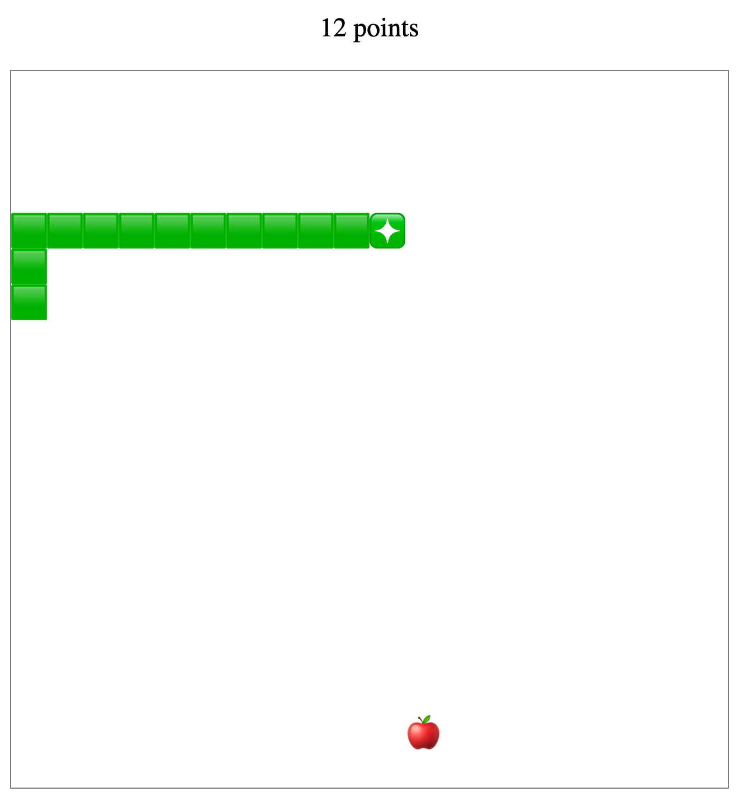

# snake-rs
Snake clone coded in Rust and WASM



## How to use

Download and install Rust!
https://www.rust-lang.org/tools/install

Use [wasm-pack](https://github.com/rustwasm/wasm-pack) to create Rust generated WebAssembly. Go [here](https://rustwasm.github.io/wasm-pack/installer/) to download and install.

Then run the following command in the root directory to build the Rust project and generate WASM files.
```bash
wasm-pack build --target web
```

Use [serve](https://github.com/vercel/serve) to serve the static `index.html`.
```bash
npx serve
```

Then go to http://localhost:3000.

## Tests
The current tests are at the end of the file in `src/snake.rs`.

Run all tests with the following command.
```bash
cargo test
```

Run individual tests by passing the test name to `cargo test`.
```bash
cargo test test_name
```

By default Rust's test runner will capture stdout and only display if the test fails. You can display output for passing tests with the `--show-output` flag.
```bash
cargo test -- --show-output
```

### Credits
Based on project by [yishn](https://github.com/yishn)
